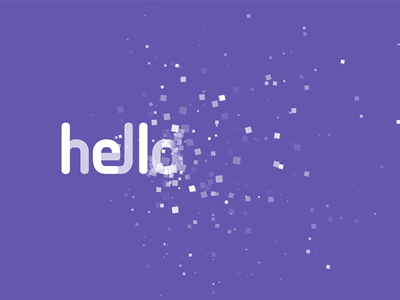
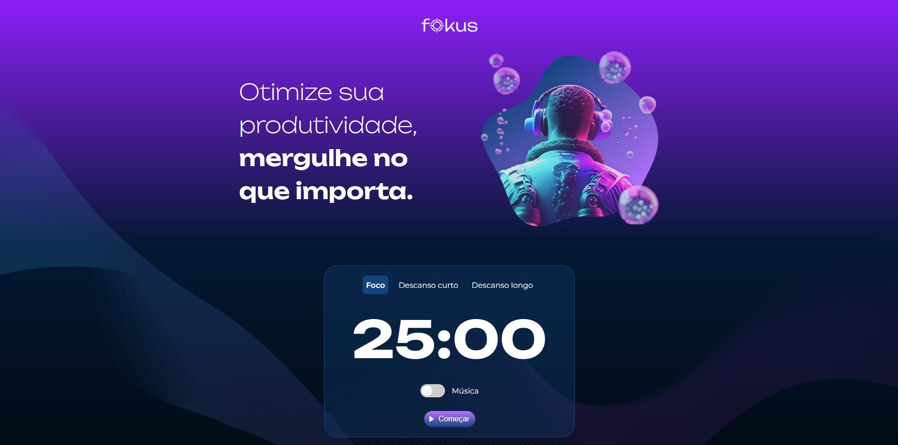
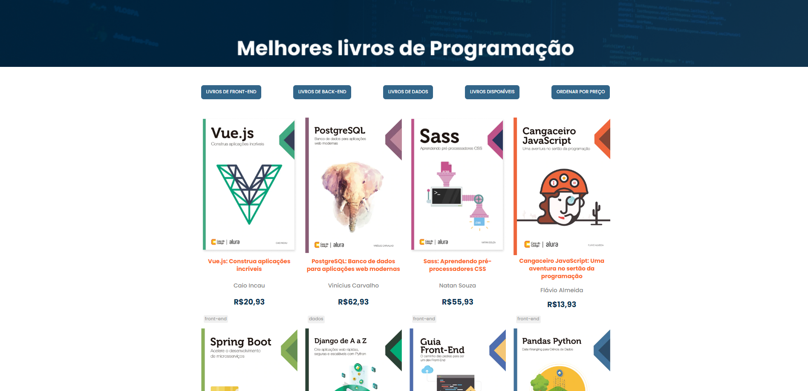

    

    
 
    
    <a href="#sobre">Sobre mim </a>
    <a href="#skilss"> Habilidades </a>
    <a href="#formacao">Formações Acadêmicas</a>
    <a href="#projetos">Projetos </a>
    <a href="#contato">Contato </a>
    
    

    

    # Bem-vindos!👋

    <!--  -->
    

    - 😊 Eu sou Victor Almeida. Um entusiasta em tecnologia.
    - 👀 Estou procurando uma oportunidade de praticar e aprimorar meus conhecimentos.
    - 🌱 Aprendendo algo novo a cada dia.
    - 💞️ Paixão por programação.

    

    

    <h2 id="sobre">Sobre Mim</h2>

    - [x] Trabalho em Equipe

    - [x] Relacionamento interpessoal

    - [x] Facilidade em Resolução e de problemas e mediação de conflitos.

    - [x] Buscando uma oportunidade para utilizar e aprimorar as habilidades adquiridas ao longo das formações.

    - [x] Pronto para enfrentar novos desafios.

    <a href="https://alurabooks-navy-chi.vercel.app/" >
        <button class="btn"> ACESSAR PORTIFÓLIO </button> 
    </a>

    

    

    <h2 id="skills">Skills</h2>

    - HTML5.
    - CSS3.
    - JavaScript.
    - PHP.
    - SQL.
    - PYTHON.
    - JAVA.
    - REACT JS (cursando).
    - NODE JS (cursando).

    

    

    <h2 id="formacao">Formação</h2>

    - Análise e Desenvolvimento de Sistemas - Uninter - Concluído.
    - Criação de APIs - Udemy - Cursando.
    - Especialização em Front-end - ORACLE ALURA - Cursando.
    - Noções de Java - Udemy - Concluído.
    - PHP - Curso em Vídeo - Concluído.
    - Python - Curso em Vídeo - Concluído.
    - Algoritmos e Lógica de Programação - Curso em Vídeo - Concluído.
    - Noções de POO - Curso em Vídeo - Concluído.

    

    

    <h1 id="projetos">Projetos</h1>

    # Espaço Amanda Fernandes
    Um projeto voltado ao negócio de Designer de sobrancelhas.

    ### Funcionalidades
    - [x] Calendário dinâmico criado com JavaScript;
    - [x] Integração com Instagram e Whatsapp
    - [x] Interface para realização de agendamento online

    ### Layout
    

    <a href="https://projeto-eaf.vercel.app/" >
        <button class="btn">VER DEMONSTRAÇÃO</button> 
    </a>

    ### Tecnologias Utilizadas
    1. HTML5
    2. CSS3
    3. JAVASCRIPT

    ### Próximos Passos
    - [ ] Integração com Banco de Dados

    - [ ] Utilização de React e Node JS

    - [ ] Criação e Consumo de API

    ## Autores

    
     

    <!-- FIM PROJETO -->

    # Projeto Alura Fokus
    Neste projeto, o objetivo foi adicionar toda a dinâmica ao site para que houvesse interação com o usuário.
    Esse projeto se baseia na técina Pomodoro.
    A Técnica é um método de gerenciamento de tempo que consiste na utilização de um cronômetro para dividir o trabalho em períodos de 25 minutos, separados por breves intervalos.

    ### Funcionalidades
    - [x] Temporizadores para foco e pausas curta e loga.
    - [x] Reprodução de trilha sonora neutra para acompanhar atividade ou pausa.
    - [x] Emissão de alerta ao fim da contagem.
    - [x] Sinais sonoros para indicar o acionamento dos controles.

    ### Layout
    

    <a href="https://projeto-fokus-rosy.vercel.app/" >
        <button class="btn">VER DEMONSTRAÇÃO</button> 
    </a>

    ### Tecnologias Utilizadas
    1. HTML5
    2. CSS3
    3. JAVASCRIPT

    ## Autores

    
    

    <!-- FIM PROJETO -->

    # Projeto Alura Books
    Neste projeto foi realizado o consumo de uma API fornecida pela Alura.
    Através do consumo desta API foi desenvolvida a sessão de exibição de cada livro bem como os seus respectivos filtros. 
    Também é possível reordenar os elementos exibidos.

    ### Funcionalidades
    - [x] Filtro por categoria.
    - [x] Filtro por Disponibilidade.
    - [x] Filtro e reordenação por preço.

    ### Layout
    

    <a href="https://alurabooks-navy-chi.vercel.app/" >
        <button class="btn">VER DEMONSTRAÇÃO</button> 
    </a>

    ### Tecnologias Utilizadas
    1. HTML5
    2. CSS3
    3. JAVASCRIPT

    ## Autores

    
    

    

    

    <h1 id="contato"> Contato </h1>

    ### Meu perfil no Linkedin: <a href="https://www.linkedin.com/in/v1774r/"> Victor Almeida </a>

    

